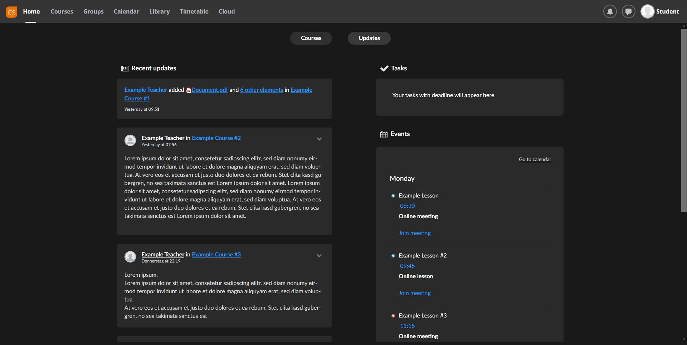

# Dark-itslearning 
  
Unofficial Dark Theme for the itslearning website.

## Preview

## Installtion
1. To use this style you need to have [Stylus](https://add0n.com/stylus.html) or xStyle installed.  
  1.1 Install [Stylus for Firefox](https://addons.mozilla.org/en-US/firefox/addon/styl-us/), [Chrome](https://chrome.google.com/webstore/detail/stylus/clngdbkpkpeebahjckkjfobafhncgmne) or [Opera](https://addons.opera.com/en-gb/extensions/details/stylus/).  
  1.2 Install [xStyle for Firefox](https://addons.mozilla.org/firefox/addon/xstyle/) or [Chrome](https://chrome.google.com/webstore/detail/xstyle/hncgkmhphmncjohllpoleelnibpmccpj).
2. Install [dark-itslearning.user.css](https://raw.githubusercontent.com/Drumber/Dark-itslearning/master/dark-itslearning.user.css) theme.

##
Check out my [UserScripts for itslearning](https://github.com/Drumber/itslearning-UserScripts).